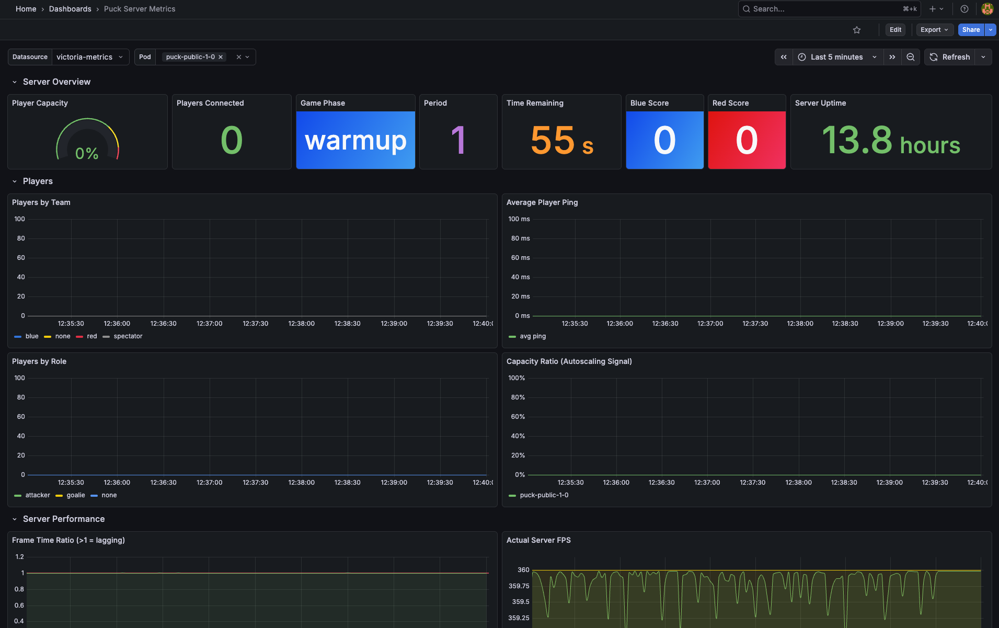

# PuckMetrics

This mod is a server-side mod that exposes game server metrics in Prometheus format. The idea is to be able to track and alert based on server performance (tickrate, frame overruns, etc). It also exposes some game-state information to aid in autoscaling.



## Installation

Installation just involves copying the `PuckMetrics.dll` file (found under the release assets) to the servers `Plugins/PuckMetrics/` folder.

## Endpoints

| Path | Description |
|------|-------------|
| `GET /metrics` | Prometheus exposition format (text/plain) |
| `GET /health` | Simple `ok` response for liveness probes |

Default: `http://<server-ip>:9100/metrics`

## Configuration

| Option | Default | Description |
|--------|---------|-------------|
| `Port` | `9100` | TCP port for the metrics HTTP server |
| `UpdateIntervalSeconds` | `2.0` | How often gauge metrics are recalculated (seconds). Counters are always instant. |
| `EnablePerPlayerMetrics` | `false` | Expose per-player ping metrics (high cardinality; enable with caution) |
| `BindAddress` | `0.0.0.0` | Address to bind the listener. Use `127.0.0.1` to restrict to localhost. |

If the config file is missing, all defaults are used.

## Metrics Reference

### Server Info

| Metric | Type | Labels | Description |
|--------|------|--------|-------------|
| `puck_server_info` | gauge | `server_name`, `game_mode`, `level`, `max_players`, `tick_rate` | Static server metadata (always 1) |
| `puck_server_uptime_seconds` | gauge | - | Seconds since the plugin started |
| `puck_network_tick_rate` | gauge | - | Configured network tick rate (e.g. 200) |

### Players / Connections

| Metric | Type | Labels | Description |
|--------|------|--------|-------------|
| `puck_players_connected` | gauge | - | Total connected players |
| `puck_players_by_team` | gauge | `team` | Players per team (`blue`, `red`, `spectator`, `none`) |
| `puck_players_by_role` | gauge | `role` | Players per role (`attacker`, `goalie`, `none`) |
| `puck_player_capacity_ratio` | gauge | - | `connected / maxPlayers` (0.0–1.0) |
| `puck_average_player_ping_milliseconds` | gauge | - | Mean ping across all players |
| `puck_player_ping_milliseconds` | gauge | `steam_id`, `username` | Per-player ping (requires `EnablePerPlayerMetrics`) |

### Game State

| Metric | Type | Labels | Description |
|--------|------|--------|-------------|
| `puck_game_phase` | gauge | `phase` | Current phase (info-style, value=1 for active phase) |
| `puck_game_period` | gauge | - | Current period number |
| `puck_game_tick_seconds_remaining` | gauge | - | Countdown timer for the current phase |
| `puck_game_overtime` | gauge | - | `1` if in overtime, `0` otherwise |
| `puck_game_score` | gauge | `team` | Current score per team (`blue`, `red`) |
| `puck_game_phase_is_warmup` | gauge | - | `1` if in warmup (server accepting players) |
| `puck_game_phase_is_active` | gauge | - | `1` if in active play |

Possible `phase` values: `none`, `warmup`, `pregame`, `faceoff`, `play`, `bluescore`, `redscore`, `replay`, `intermission`, `gameover`, `postgame`

### Scoring Events (Counters)

| Metric | Type | Labels | Description |
|--------|------|--------|-------------|
| `puck_goals_total` | counter | `team` | Total goals scored (`blue`, `red`) |
| `puck_games_completed_total` | counter | - | Total games that reached PostGame |

### Server Performance

These metrics detect when the server isn't keeping up with its target tick rate, the primary cause of client-perceived stutter.

| Metric | Type | Labels | Description |
|--------|------|--------|-------------|
| `puck_actual_fps` | gauge | - | Actual server FPS (should match `tick_rate`) |
| `puck_frame_time_avg_seconds` | gauge | - | Average frame time over collection interval |
| `puck_frame_time_p90_seconds` | gauge | - | 90th percentile frame time |
| `puck_frame_time_p99_seconds` | gauge | - | 99th percentile frame time (spike detection) |
| `puck_frame_time_max_seconds` | gauge | - | Worst frame time in the interval |
| `puck_frame_time_ratio` | gauge | - | `avg_frame_time / target_frame_time` - >1.0 means lagging |
| `puck_frame_overruns_total` | counter | - | Frames exceeding target frame time (cumulative) |
| `puck_physics_starvation_total` | counter | - | Frames where physics fell behind (>40ms, causing jittery movement) |
| `puck_gc_collections_total` | counter | `generation` | GC collections per generation (0, 1, 2) - correlates with frame spikes |
| `puck_gc_memory_bytes` | gauge | - | Current managed heap size |

#### Understanding Performance Metrics

- **`puck_frame_time_ratio > 1.0`** - the server cannot sustain its configured tick rate. Clients will feel stutter.
- **`puck_frame_time_p99_seconds` spikes** - occasional frame spikes (often GC). Check `puck_gc_collections_total` rate.
- **`puck_physics_starvation_total` increasing** - physics simulation is falling behind, causing jerky player/puck movement.
- **`puck_frame_overruns_total` rate** - sustained increase means the server is consistently overloaded.

## Kubernetes Integration

### Prometheus Scraping

Add pod annotations for auto-discovery:

```yaml
metadata:
  annotations:
    prometheus.io/scrape: "true"
    prometheus.io/port: "9100"
    prometheus.io/path: "/metrics"
```

### Horizontal Pod Autoscaler (HPA)

Scale based on player capacity:

```yaml
apiVersion: autoscaling/v2
kind: HorizontalPodAutoscaler
metadata:
  name: puck-server-hpa
spec:
  scaleTargetRef:
    apiVersion: apps/v1
    kind: Deployment
    name: puck-server
  minReplicas: 1
  maxReplicas: 10
  metrics:
    - type: Pods
      pods:
        metric:
          name: puck_player_capacity_ratio
        target:
          type: AverageValue
          averageValue: "0.7"
```

This scales up when servers average 70% capacity.


## Building

```bash
dotnet build .
```

Requires game DLLs in `libs/`. Copy `local.targets.example` to `local.targets` and adjust the path to auto-deploy on build.
